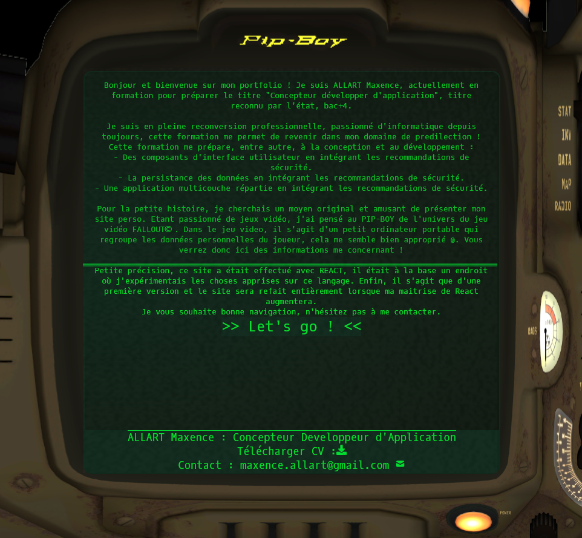
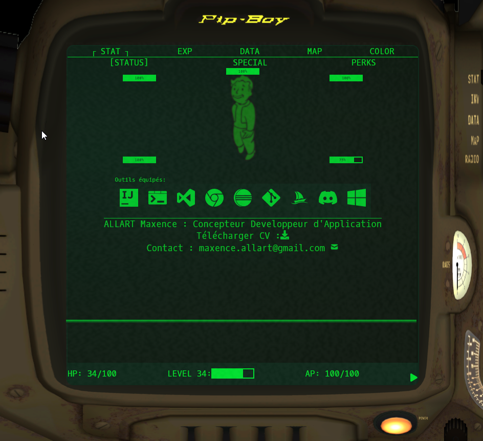
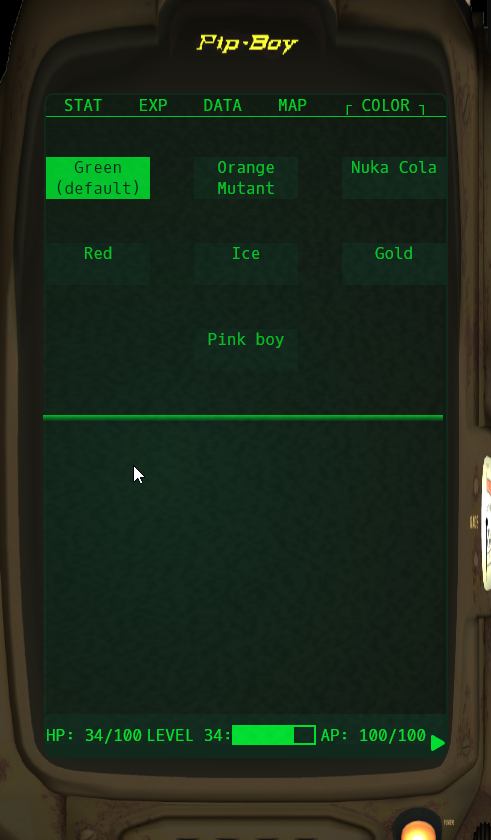
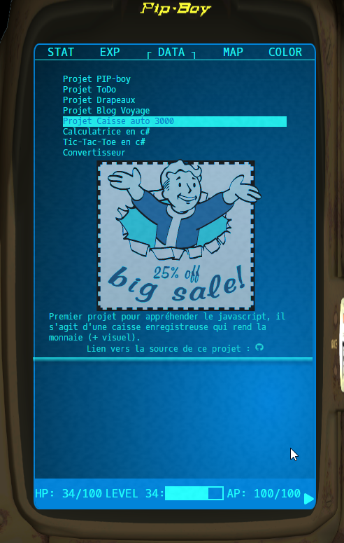

Bonjour et bienvenue sur mon portfolio ! Je suis ALLART Maxence, actuellement en formation pour préparer le titre "Concepteur développer d'application", titre reconnu par l'état, bac+4.

Je suis en pleine reconversion professionnelle, passionné d'informatique depuis toujours, cette formation me permet de revenir dans mon domaine de predilection !
Cette formation me prépare, entre autre, à la conception et au développement :
- Des composants d'interface utilisateur en intégrant les recommandations de sécurité.
- La persistance des données en intégrant les recommandations de sécurité.
- Une application multicouche répartie en intégrant les recommandations de sécurité.

Pour la petite histoire, je cherchais un moyen original et amusant de présenter mon site perso. Etant passionné de jeux vidéo, j'ai pensé au PIP-BOY de l'univers du jeu vidéo FALLOUT© . Dans le jeu video, il s'agit d'un petit ordinateur portable qui regroupe les données personnelles du joueur, cela me semble bien approprié ☺. Vous verrez donc ici des informations me concernant !

Petite précision, ce site a était effectué avec REACT, il était à la base un endroit où j'expérimentais les choses apprises sur ce langage. Enfin, il s'agit que d'une première version et le site sera refait entièrement lorsque ma maitrise de React augmentera.
Je vous souhaite bonne navigation, n'hésitez pas à me contacter.

Petits aperçus :

<h1 style="font-size: 24px; margin-bottom: 10px;">Allart Maxence</h1>

Concepteur Développeur d'Application

<strong>Email:</strong> maxence.allart@gmail.com

<strong>Phone:</strong> (+33) 652792343

<strong>Website:</strong> www.maxenceallart.fr

<strong>Address:</strong> Tourcoing, France.

